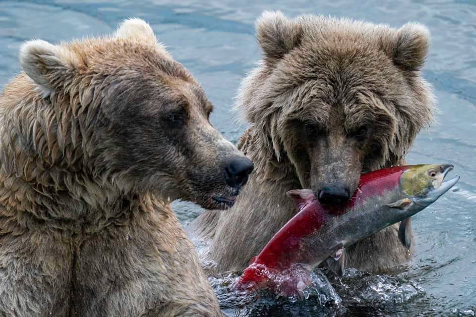

This data story examines the relationship between endemic, endangered species (i.e., mammals and fish) and environmental protection expenditures across countries through the lens of the 14th and 15th *Sustainable Development Goals* (SDGs), Life Below Water and Life on Land. Some of the questions addressed in this data story include: Do governments adjust their expenditures based on biodiversity loss? How does government spending align with commitments to Life Below Water and Life on Land? What can **you** do to promote biodiversity conservation?

View data story:

[HERE](https://barzigt0-oss.github.io/data_story_2/)

or visit the github repo:

[HERE](https://github.com/barzigt0-oss/data_story_2)

{fig-align="right" width="393"}
