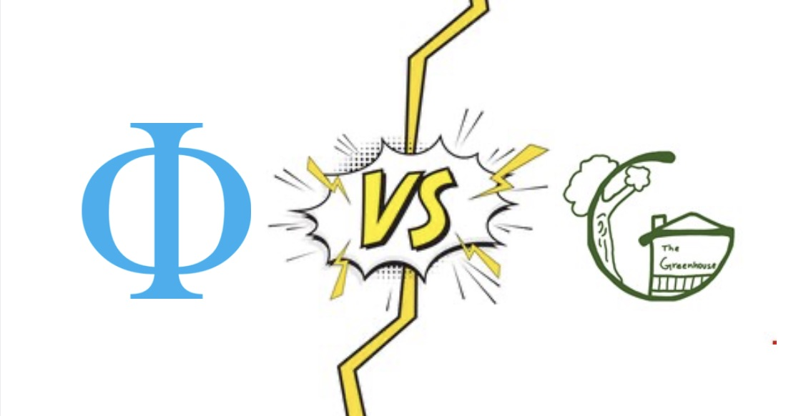

This app allows you to explore the energy consumption of two neighboring student houses (i.e., The Greenhouse and The Phi Society of 1883) at the University of the South in relation to regional consumption averages according to the U.S. Energy Information Administration. Learn what student practices potentially contribute to consumption and conservation.

Visit the github repo

[HERE](https://github.com/barzigt0-oss/Data_Story_4)

{fig-align="right" width="315"}
