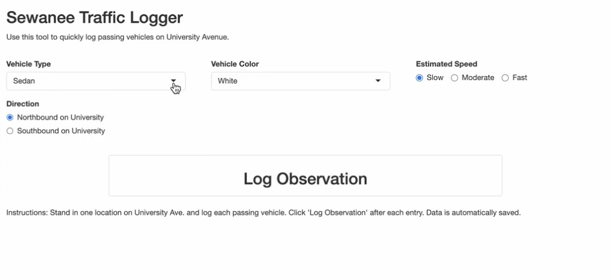

The following data story explores the data found using a data entry app of my creation. The data entry app allows the user to log traffic data on University Avenue in Sewanee, Tennessee. Using the interactive graph, explore how certain cars drive during Sewanee rush hour.

View data story:

[HERE](https://barzigt0-oss.github.io/data_story_5/)

or visit github repo:

[HERE](https://github.com/barzigt0-oss/data_story_5)

{fig-align="right"}
